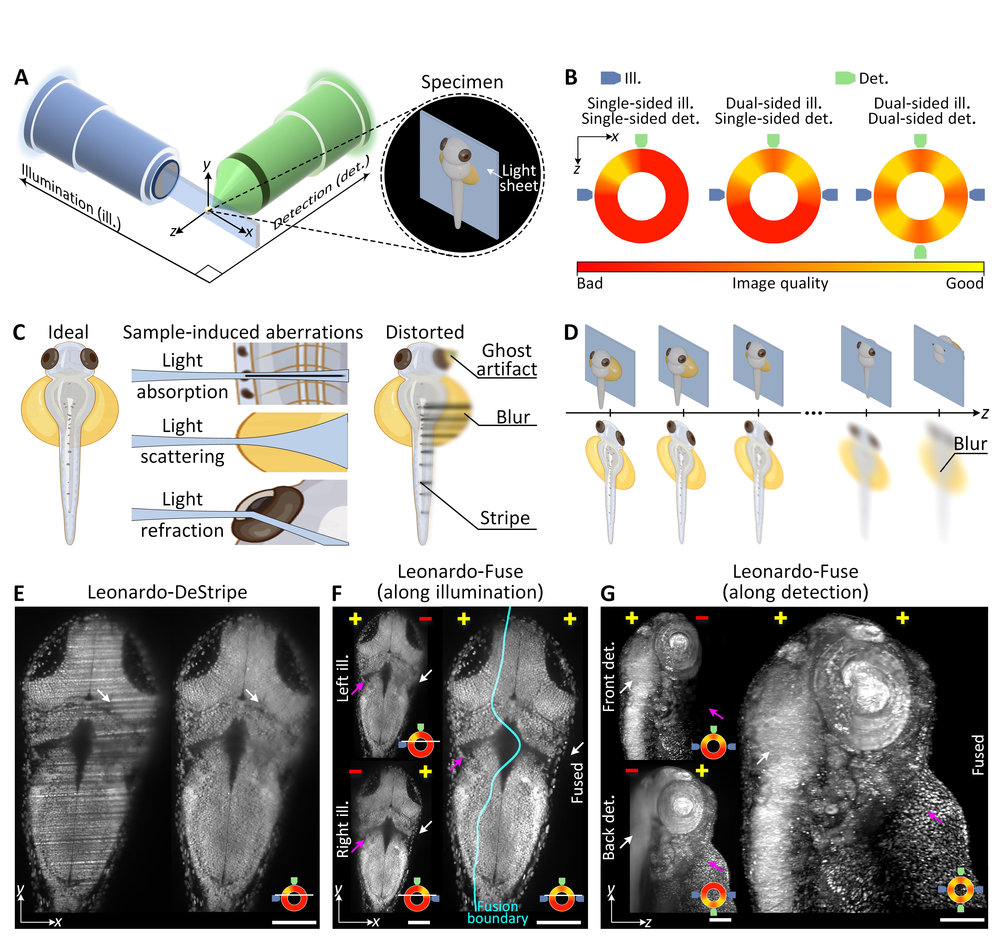

:html_theme.sidebar_secondary.remove:

.. image:: https://img.shields.io/github/actions/workflow/status/peng-lab/leonardo_toolset/docs.yml?branch=main
   :target: https://github.com/peng-lab/leonardo_toolset/actions
   :alt: Build Status

Leonardo
=======

**A toolset to remove sample-induced aberrations in light sheet microscopy images**

:mod:`Leonardo` is an AI-empowered image processing toolbox that is able to resolve sample-induced 
aberrations for light-sheet fluorescence microscopy: (1) :mod:`Leonardo-DeStripe` removes the stripe artifacts caused by light absorption; 
(2) :mod:`Leonardo-Fuse` reconstructs one single high-quality image from dual-sided illumination and/or dual-sided detection while 
eliminating optical distortions (ghosts) caused by light refraction.

|
Manuscript
----------

Preprint is available `here <https://doi.org/10.21203/rs.3.rs-5853941/v1>`_.

.. grid:: 1 3 3 3
   :gutter: 3

   .. grid-item-card::
      :text-align: center

      **Installation**
      ^^^

      How to install Leonardo.

      +++

      .. button-ref:: installation
         :color: secondary
         :click-parent:

         To the Installation

   .. grid-item-card::
      :text-align: center

      **Tutorials**
      ^^^

      Get started with example notebooks and video tutorials.

      +++

      .. button-ref:: tutorials
         :color: secondary
         :click-parent:

         To the Tutorials

   .. grid-item-card::
      :text-align: center

      **API Reference**
      ^^^

      Detailed descriptions of Leonardo modules: DeStripe, Fuse_illu, Fuse_det.

      +++

      .. button-ref:: api
         :color: secondary
         :click-parent:

         To the API Reference

.. toctree::
   :hidden:

   installation
   tutorials
   api

